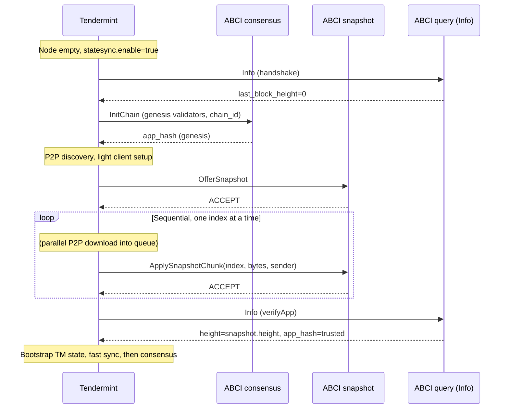
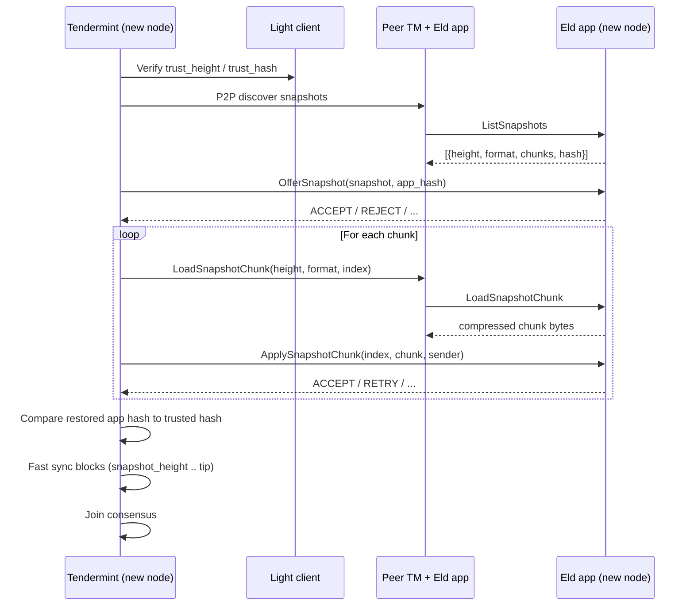

> **DEPRECATED:** References to `trie_snapshot` / `CadoTrieSnapshot` in this document are obsolete. Canonical epoch snapshot CADO is `app_state_snapshot` (`AppStateSnapshot`).

# ABCI Snapshot State Sync

Overview of how the Eld node app uses the CometBFT/Tendermint **ABCI Snapshot** interface to create application state snapshots that other nodes can discover and download during startup.

This document describes the intended design, the current implementation, and how a new node should be configured to bootstrap via state sync rather than replaying the full block history.

---

## Why state sync

A new node joining an existing chain has two ways to catch up:

| Method | What it does | Cost |
|--------|--------------|------|
| **Block replay (fast sync)** | Downloads and replays historical blocks through ABCI | Grows with chain age; slow for long histories |
| **State sync (ABCI snapshots)** | Downloads a compressed snapshot of application state at a recent height, then fast-syncs only blocks after that height | Bounded by snapshot size; much faster for mature chains |

Tendermint drives state sync entirely through the ABCI `Snapshot` connection. The application is responsible for **creating**, **listing**, **serving**, and **restoring** snapshots. Tendermint handles peer discovery, light-client verification of the trusted app hash, parallel chunk download, and the transition to fast sync after restore.

Reference: [Tendermint ADR-053 — State Sync Prototype](https://github.com/tendermint/tendermint/blob/main/docs/architecture/adr-053-state-sync-prototype.md).

---

## Architecture in Eld

The node app exposes four separate ABCI connections (see `init_abci_server` in `abci_interface/mod.rs`):

```
┌─────────────────┐     consensus / mempool / info / snapshot
│   Tendermint    │◄────────────────────────────────────────────►  eld-node
└─────────────────┘
        │
        │  state sync P2P (ListSnapshots, LoadSnapshotChunk)
        ▼
   peer nodes
```

| Component | Location | Role |
|-----------|----------|------|
| `SnapshotConnection` | `abci_interface/snapshot/connection.rs` | Implements the ABCI `Snapshot` trait (`ListSnapshots`, `OfferSnapshot`, `LoadSnapshotChunk`, `ApplySnapshotChunk`) |
| `SnapshotManager` | `abci_interface/snapshot/manager.rs` | Chunking, LZ4 compression, metadata, and storage orchestration |
| `SnapshotStorage` trait | `storage/traits.rs` | Persistence API for snapshot metadata and chunks |
| `RocksDBStorage` | `storage/rocksdb.rs` | Stores snapshots as CADO entries under snapshot-specific path prefixes |
| `ConsensusConnection` | `abci_interface/consensus/consensus.rs` | Triggers snapshot **creation** at epoch boundaries |

`SnapshotManager` is constructed in `main.rs` and shared between the consensus and snapshot ABCI connections.

---

## ABCI Snapshot interface (summary)

Tendermint calls these methods on the **snapshot** ABCI connection:

| ABCI method | Direction | Purpose |
|-------------|-----------|---------|
| `ListSnapshots` | TM → app (on serving peers) | Return metadata for available snapshots (height, format, chunk count, hash) |
| `LoadSnapshotChunk` | TM → app (on serving peers) | Return one compressed chunk by `(height, format, chunk_index)` |
| `OfferSnapshot` | TM → app (on restoring node) | Propose a snapshot discovered from a peer; app accepts or rejects |
| `ApplySnapshotChunk` | TM → app (on restoring node) | Deliver one chunk; app stores and eventually reconstructs state |

### Snapshot metadata shape (ABCI)

```protobuf
message Snapshot {
  uint64 height   = 1;  // block height when snapshot was taken
  uint32 format   = 2;  // application format version (Eld uses 1)
  uint32 chunks   = 3;  // number of chunks
  bytes  hash     = 4;  // must match app hash at height (for verification)
  bytes  metadata = 5;  // optional application metadata
}
```

Eld maps this to internal `SnapshotMetadata` / `SnapshotChunk` types in `storage/traits.rs`. Chunks are LZ4-compressed, capped at **10 MB** uncompressed per chunk, with per-chunk SHA-256 hashes recorded in metadata.

---

## Receiving and applying snapshots (detailed)

This section answers: which ABCI call actually receives snapshot data, whether chunks arrive in one shot, who parses the bytes, how the node stays in a safe "pending" state during restore, and what Tendermint provides versus what Eld must implement.

### Two roles on the snapshot ABCI connection

The same four ABCI methods exist on every node, but they are used differently depending on whether the node is **serving** or **restoring**:

| ABCI method | Restoring node (new joiner) | Serving node (existing validator) |
|-------------|----------------------------|-----------------------------------|
| `OfferSnapshot` | **Receives snapshot metadata** (height, format, chunk count, hash). No payload bytes yet. App accepts or rejects the restore session. | Not called |
| `ApplySnapshotChunk` | **Receives snapshot data** — one chunk per call, as opaque `bytes`. App stores and eventually reassembles. | Not called |
| `ListSnapshots` | Not used during restore (only if this node later serves others) | Returns metadata for snapshots the app has on disk |
| `LoadSnapshotChunk` | Not used during restore | Returns one chunk when TM forwards a peer's P2P `ChunkRequest` |

**Only `ApplySnapshotChunk` carries snapshot payload bytes on the restoring node.** `OfferSnapshot` is a handshake: it tells the app *which* snapshot is about to arrive and asks permission to start.

On serving peers, chunk bytes never go through `ApplySnapshotChunk`. Their Tendermint receives a P2P `ChunkRequest`, calls **local** `LoadSnapshotChunk` on the Eld app, and relays the returned bytes back over P2P.

### Chunks are not received all at once

Download and apply are deliberately decoupled:

```
                    PARALLEL (Tendermint)                    SEQUENTIAL (ABCI)
                    ─────────────────────                    ─────────────────

  Peer A ──chunk 3──┐
  Peer B ──chunk 0──┤
  Peer C ──chunk 7──┼──► TM chunk queue (temp files) ──► ApplySnapshotChunk(0)
  Peer A ──chunk 1──┤         ▲                            ApplySnapshotChunk(1)
  Peer B ──chunk 4──┘         │                            ApplySnapshotChunk(2)
                              │                            ...
                    4 concurrent fetchers                  one ABCI call per chunk
```

Tendermint's state sync reactor (`third_party/tendermint/statesync/syncer.go`):

1. Spawns **4 concurrent chunk fetchers** that request chunks from peers over P2P (`ChunkRequest` / `ChunkResponse`).
2. Buffers arrived chunks on disk in a temp directory (`chunkQueue` in `statesync/chunks.go`) until all indices `0 .. chunks-1` are present.
3. Calls **`ApplySnapshotChunk` sequentially** in index order (`nextUp()` always returns the lowest not-yet-applied index).
4. Waits for each ABCI response before sending the next chunk (unless the app returns `RETRY` / `REFETCH`).

So a large snapshot may take many round-trips. Each chunk is a separate ABCI request on the **snapshot** connection. The consensus connection is not used for chunk delivery.

`RequestApplySnapshotChunk` carries:

| Field | Meaning |
|-------|---------|
| `index` | Zero-based chunk index (0, 1, 2, …) |
| `chunk` | Opaque bytes for this chunk (compressed on the wire for Eld format 1) |
| `sender` | P2P peer ID that provided this chunk (for banning bad senders) |

Notably, **`height` and `format` are not included** in `ApplySnapshotChunk`. The app must remember which snapshot was accepted in the preceding `OfferSnapshot` call and associate incoming chunks with that session.

### Who decides parsing?

**The application owns the entire snapshot format.** Tendermint treats chunk bytes as opaque.

| Responsibility | Owner |
|----------------|-------|
| What bytes mean (CADO export, trie dump, protobuf, etc.) | **Eld app** |
| `format` version semantics (Eld uses `1`) | **Eld app** |
| Chunking, compression (LZ4), per-chunk hashing | **Eld app** (on create and restore) |
| When all chunks are present and state is complete | **Eld app** (inside `apply_snapshot_chunk`) |
| Final correctness check: `LastBlockAppHash` and `LastBlockHeight` via `Info` | **Tendermint** queries; **Eld app** must report correct values |
| Light-client trust anchor (`trust_height`, `trust_hash`) | **Operator config** + **Tendermint** light client |

Tendermint does **not** deserialize, decompress, or validate the internal structure of snapshot chunks. After all chunks are applied, it calls `Info` on the **query** connection and checks:

```text
resp.LastBlockAppHash == snapshot.trustedAppHash   (from light client)
resp.LastBlockHeight  == snapshot.Height
```

If those match, restore is considered successful. Per-chunk integrity (LZ4, SHA-256 of uncompressed data, bincode layout) is entirely Eld's job during `ApplySnapshotChunk`.

ADR-053 explicitly allows starting without per-chunk Merkle verification; a final app-hash check is sufficient for v1. Eld can add stricter per-chunk checks in `format` 2 without TM changes.

### How restore is applied inside the app (target flow)

On the restoring node, the snapshot ABCI path should implement this state machine:

```
OfferSnapshot (metadata only)
    │
    ├─ Validate format, hash vs light-client app_hash, disk space
    ├─ Create in-memory RestoreSession { height, format, chunks, hash, received: BitSet }
    ├─ Optionally write placeholder SnapshotMetadata to staging area
    └─ Return ACCEPT

ApplySnapshotChunk (called once per index, in order)
    │
    ├─ Store chunk bytes (staging RocksDB column / temp files)
    ├─ Mark index received
    ├─ If not all indices received → return ACCEPT (keep going)
    └─ If all indices received:
           ├─ Decompress each chunk in order
           ├─ Verify per-chunk SHA-256
           ├─ Concatenate → deserialize (bincode / custom format)
           ├─ Atomic write to application RocksDB (CADO keyspace)
           ├─ Rebuild in-memory AppState (envelope, trie, app_hash, block_height)
           └─ Return ACCEPT

(Tendermint calls Info on query connection)
    │
    └─ App must report last_block_height == snapshot.height
       and last_block_app_hash == trusted hash
```

Until the final chunk is applied and state is rebuilt, `Info` will still report height 0 (or pre-restore values). Tendermint only verifies **after** `applyChunks` completes.

### Pending state: what Tendermint does vs what Eld must do

There is no single ABCI call named "enter pending mode." Coordination is split across TM internals and app-side session tracking.

#### Tendermint (automatic)

When `[statesync] enable = true` and the node has no local block history:

| Mechanism | Behavior |
|-----------|----------|
| **Skip state sync** | If `LastBlockHeight > 0`, state sync is not attempted |
| **Consensus reactor `waitSync`** | Consensus starts with `waitSync = true`; the node does not fully participate in block production/voting until sync phases complete |
| **`StateSyncing` metric** | Set to `1` during state sync (`node.go`) |
| **No block replay during restore** | `DeliverTx` / `BeginBlock` / `Commit` are not driven for historical catch-up while state sync runs |
| **Background goroutine** | `startStateSync()` runs restore asynchronously after `OnStart` |
| **Post-restore bootstrap** | TM writes its own `stateStore` from the light client, saves `LastSeenCommit` at snapshot height, then switches to fast sync or consensus |
| **InitChain still runs** | During ABCI handshake, if `Info` reports `last_block_height == 0`, TM calls `InitChain` on the **consensus** connection before state sync begins (`consensus/replay.go`) |

The restoring node does not need to configure a special "pending" flag in Tendermint. TM already avoids driving consensus block processing until restore + fast sync finish.

#### Eld app (we must build)

| Concern | What to implement |
|---------|-------------------|
| **Restore session** | Struct keyed by `(height, format)` tracking accepted snapshot and which chunk indices have arrived; lives for the duration of `OfferSnapshot` → last `ApplySnapshotChunk` |
| **Reject consensus traffic during restore** | While `RestoreSession` is active, `DeliverTx` / `Commit` should not mutate production state. Today TM should not send these during state sync, but defensive checks are prudent |
| **Do not use `--init-data`** | On first bootstrap, app starts empty; restore replaces genesis-equivalent state. `--init-data` would load stale DB state and conflict with snapshot restore |
| **`Info` must reflect restored state** | After final chunk applied, `InfoConnection::info` must return `last_block_height` and `last_block_app_hash` matching the snapshot (TM calls this in `verifyApp`) |
| **HTTP/API readiness** | Eld's content server and RPC should not serve chain queries against partial state. Gate on restore session complete (similar to existing ABCI-ready signaling) |
| **Staging vs production DB** | Write chunks to a staging area first; only swap into the live RocksDB keyspace atomically when all chunks verify. On `REJECT_SNAPSHOT` / `ABORT`, discard staging |
| **`OfferSnapshot` → metadata** | Create `SnapshotMetadata` on `ACCEPT` so `put_chunk` has a place to attach data (current code gap) |

There is no Tendermint API to ask "is restore done?" from the app side. The app knows it is done when it has applied all chunks and updated its committed state. Tendermint knows when `verifyApp` succeeds.

### Startup ordering on a new node



`InitChain` on the consensus connection still runs at height 0 before snapshot restore. Eld's `init_chain` sets up validators and genesis accounts. The snapshot restore then replaces application state at the snapshot height. The exact interaction between `InitChain` state and restored state must be designed so the final `Info` response and app hash are consistent (production work).

### Tendermint protocol vs Eld responsibilities

#### Provided by Tendermint / CometBFT (no app code needed)

- P2P channels `SnapshotChannel` and `ChunkChannel` for discovery and chunk transfer
- Snapshot pool: aggregate `ListSnapshots` responses from peers, pick best snapshot by height/format/peer count
- Light client `StateProvider`: trusted `app_hash` at snapshot height from `rpc_servers` + `trust_height` + `trust_hash`
- Parallel chunk download with retries, timeouts, and bad-peer rejection
- Sequential `ApplySnapshotChunk` orchestration with `RETRY` / `REFETCH` / `REJECT_SNAPSHOT` handling
- Post-restore `verifyApp` via ABCI `Info`
- Bootstrapping Tendermint's own `state.Store` and `blockStore` at snapshot height
- Transition: state sync → fast sync (blocks after snapshot) → consensus
- Serving path: forward P2P `ChunkRequest` to local `LoadSnapshotChunk`

#### Must be built in Eld

- **Snapshot creation**: serialize application state at epoch boundaries; chunk, compress, hash, persist
- **Format definition**: deterministic serialization of CADO keyspace + envelope fields for `format = 1`
- **`ListSnapshots`**: read metadata from RocksDB, map to ABCI `Snapshot` (including correct `hash` field)
- **`LoadSnapshotChunk`**: return stored compressed bytes for serving peers
- **`OfferSnapshot`**: validate and open a restore session; create staging metadata
- **`ApplySnapshotChunk`**: store chunks, track progress, reassemble, decompress, verify, deserialize, atomic DB restore, rebuild `AppState`
- **Restore session state machine**: track active snapshot across chunk calls (height not in `ApplySnapshotChunk` request)
- **`Info` accuracy**: report restored height and app hash after final chunk
- **Pruning**: garbage-collect old snapshots on serving nodes
- **Operational**: disk space checks, async snapshot creation, API gating during restore
- **Tendermint config**: enable `[statesync]`, set trust anchor, seeds/peers (deployment concern, not Rust)

---

## Creating snapshots (serving side)

### When snapshots are taken

Snapshots should be **periodic, deterministic, and consistent** across nodes (per ADR-053). In Eld:

1. **ABCI state-sync snapshots** — triggered in `ConsensusConnection::end_block` when a **new epoch starts** (`new_epoch > current_epoch`). Epoch length is `BLOCKS_PER_EPOCH` (20 blocks, defined in `eld_common::constants`).

2. **Trie snapshots** (separate concern) — in `commit()`, a `TrieSnapshot` CADO is persisted every `BLOCKS_PER_EPOCH` blocks. This is an internal Merkle/trie checkpoint used for local recovery and pruning research; it is **not** the same payload served over the ABCI snapshot interface, though a production design may incorporate trie data into the ABCI snapshot format.

### Creation pipeline

```
end_block (epoch boundary)
    │
    ▼
SnapshotManager::create_snapshot(height, data)
    │
    ├─ Split `data` into 10 MB chunks
    ├─ LZ4-compress each chunk
    ├─ SHA-256 hash each uncompressed chunk
    ├─ Write SnapshotMetadata (height, format_version=1, chunk_count, app_hash, chunk_hashes)
    └─ Write each SnapshotChunk to RocksDB via SnapshotStorage
```

Storage layout:

- Metadata: `CadoType::SnapshotMetadata` keyed by hashed height
- Chunks: `CadoType::SnapshotChunk` keyed by `(height, chunk_index)`

### Serving snapshots to peers

When another node's Tendermint performs state sync, it queries **serving peers** over P2P. Each peer's Tendermint calls **that peer's** Eld app:

1. **`ListSnapshots`** — `SnapshotConnection` calls `SnapshotManager::list_snapshots(100)` and maps results to ABCI `Snapshot` messages. Peers typically advertise their most recent snapshots.

2. **`LoadSnapshotChunk`** — Tendermint requests chunk `(height, format, index)`. `SnapshotConnection` returns the compressed bytes from RocksDB.

The Eld app does not participate in P2P snapshot discovery directly; Tendermint handles peer selection, parallel downloads, and chunk ordering.

### Operational requirements for serving nodes

- Snapshots must exist at predictable heights (epoch boundaries) so multiple validators expose the same snapshots.
- Old snapshots should be pruned (`SnapshotManager::prune_snapshots` exists for tests; production pruning is not yet wired).
- Sufficient disk space is checked in `OfferSnapshot` / `has_capacity_for` on the **receiving** side; serving nodes need headroom for snapshot storage alongside RocksDB.

---

## Requesting and restoring snapshots (new node)

State sync is initiated by **Tendermint**, not by the Eld app directly. The application only responds to `OfferSnapshot` and `ApplySnapshotChunk` during restore. See **Receiving and applying snapshots (detailed)** above for the full chunk delivery model, parsing ownership, and pending-state behavior.

### Preconditions

Per Tendermint behavior:

- The node must be **empty**: `LastBlockHeight == 0`, no existing block store.
- State sync is **not attempted** if the node already has local TM state.
- At least some peers in the network must be serving snapshots (`ListSnapshots` / `LoadSnapshotChunk`).

For Eld specifically:

- Use an **empty** Tendermint data directory (`tendermint-data-*` volume wiped or fresh).
- Use an **empty** application database, **or** a database that will be fully replaced by the restore (see gaps below).
- Do **not** pass `--init-data` on first start of a state-syncing node; the app should start with empty in-memory state and let Tendermint drive restoration.

### Tendermint configuration

Enable state sync in `config.toml`:

```toml
[statesync]
enable = true

# Light-client trust anchor (obtain from a trusted source / block explorer)
rpc_servers = "https://rpc1.example.com:26657,https://rpc2.example.com:26657"
trust_height = 12345
trust_hash = "ABC123..."   # header hash at trust_height
trust_period = "168h0m0s"

discovery_time = "15s"
# temp_dir = ""            # optional; defaults to OS tempdir
```

Also configure `seeds` or `persistent_peers` pointing at nodes known to serve snapshots. `fast_sync = true` is typical so TM can catch up blocks committed after the snapshot height.

State sync is disabled by default in the bundled Tendermint configs (`enable = false`).

### Restore flow (Tendermint-driven)



### What `SnapshotConnection` does on restore (current code)

See the target restore state machine in **Receiving and applying snapshots (detailed)**. Current implementation:

**`offer_snapshot`**

1. Reject if snapshot already exists locally.
2. Accept only `format == 1`.
3. Reject if offered `hash` does not match light-client `app_hash`.
4. Check disk capacity (estimated from chunk count).
5. Return `ACCEPT` if all checks pass.

**`apply_snapshot_chunk`** (current — incomplete)

1. Store the chunk via `SnapshotManager::put_chunk`.
2. **Not yet implemented:** detect when all chunks are present, reassemble, decompress, deserialize, and write application state to RocksDB.
3. Always returns `ACCEPT` today regardless of completeness.

**`list_snapshots` / `load_snapshot_chunk`** on the restoring node are only relevant if this node later serves snapshots to others.

---

## New node startup sequence

Recommended startup order for a node bootstrapping via state sync:

### 1. Prepare directories

| Directory | State |
|-----------|-------|
| Tendermint `data/` | Empty (no `blockstore.db`, `state.db`) |
| Eld RocksDB (`db_path`) | Empty or absent |
| Genesis + validator keys | Present (genesis defines chain id and validator set; state sync does not replace genesis) |

Wipe TM and app volumes together when intentionally resetting. Never reset only one side (see `SYNC_ON_RESTART.md`).

### 2. Configure Tendermint

- `[statesync] enable = true` with valid `trust_height`, `trust_hash`, `rpc_servers`.
- `seeds` / `persistent_peers` include snapshot-serving nodes.
- `proxy_app` points at the Eld ABCI socket (e.g. `tcp://eld-app:26658`).
- Production entrypoint: `tendermint node` **without** `unsafe_reset_all`.

### 3. Start Eld node app

```
eld-node --chainid <chain_id>
# Do NOT use --init-data on a fresh state-sync bootstrap
```

Startup path:

1. `main.rs` opens RocksDB, creates `SnapshotManager`, calls `init_abci_server`.
2. With `init_data = false` and empty DB, `initialize_with_data` loads genesis-equivalent state (height 0, empty trie).
3. ABCI server binds consensus, mempool, info, and **snapshot** connections.
4. Tendermint connects and begins handshake. If the TM store is empty and state sync is enabled, TM enters state sync **before** normal block replay.

### 4. Tendermint performs state sync

Tendermint discovers snapshots, calls `OfferSnapshot` / `ApplySnapshotChunk` on the Eld app, and verifies the final app hash against the light-client trusted hash.

### 5. Fast sync and consensus

After restore, Tendermint fast-syncs blocks from `snapshot_height + 1` to the chain tip, then joins consensus. The Eld app processes those blocks normally via `DeliverTx` / `Commit`.

### 6. Subsequent restarts

For a node that has already synced:

- Persist both TM and Eld volumes.
- Start with `--init-data` so the app reloads committed state from RocksDB (`initialize_with_data`).
- State sync is skipped automatically because TM `LastBlockHeight > 0`.

---

## Relationship to other state mechanisms

| Mechanism | Purpose | Used for state sync? |
|-----------|---------|---------------------|
| ABCI snapshots (`SnapshotManager`) | Cross-node bootstrap via Tendermint P2P | **Yes** |
| `TrieSnapshot` CADO (per-epoch in `commit`) | Local trie/cache checkpoint | No (internal) |
| `StateVersion` CADO | Tracks latest committed app hash and height | Reload on restart (`--init-data`), not for P2P sync |
| Block replay / fast sync | TM-level catch-up | Complements state sync for post-snapshot blocks |

A complete production snapshot payload would likely serialize the CADO keyspace (accounts, staking, capacity, contracts, pinboard metadata, etc.) plus envelope fields needed to reconstruct `AppState` at the snapshot height. The `TrieSnapshot` structure is a natural building block for the Merkle/state-trie portion.

---

## Current implementation status

The scaffolding is in place; end-to-end state sync is **not production-ready**. Known gaps:

| Area | Current behavior | Needed for production |
|------|------------------|----------------------|
| Snapshot payload | `end_block` passes `app_hash` bytes to `create_snapshot`, not full state serialization | Serialize restorable application state at epoch boundaries |
| `app_hash` in metadata | Set to empty vec in `create_snapshot` (TODO) | Populate from committed `AppState.app_hash` at snapshot height |
| `offer_snapshot` on accept | Returns `ACCEPT` without creating `SnapshotMetadata` first | Create placeholder metadata on accept so chunks can be stored |
| `apply_snapshot_chunk` | Stores chunks; does not reassemble or restore RocksDB / `AppState` | Decompress, verify all chunk hashes, deserialize, atomic DB restore |
| Height tracking during restore | Assumes "most recent" snapshot from `list_snapshots` | Track the snapshot currently being restored across chunk calls |
| Pruning | `prune_snapshots` only in test helpers | Periodic GC of old snapshots on serving nodes |
| Tendermint config | `statesync.enable = false` by default | Enable and document trust parameters per deployment |
| Async creation | Snapshot creation runs inline in `end_block` | Move to background task to avoid blocking epoch transitions on large state |

Unit tests in `snapshot/manager.rs` validate chunking, compression, listing, and round-trip for arbitrary byte payloads. Integration with Tendermint state sync has not been exercised end-to-end in CI.

---

## Recommended target design

### Snapshot format (version 1)

A single deterministic blob (then chunked) containing at minimum:

- Block height and epoch at snapshot time
- App hash (32 bytes, big-endian as committed)
- Serialized CADO export or subset needed for consensus state
- Optional: embedded `TrieSnapshot` for fast trie rebuild

All nodes taking snapshots at the same epoch boundary should produce **identical** chunk hashes given the same chain history.

### Creation schedule

- Take ABCI snapshots every epoch (`height % BLOCKS_PER_EPOCH == 0`), aligned with `TrieSnapshot` persistence.
- Run creation asynchronously after `commit` returns.
- Retain the last *N* snapshots (e.g. 3–5) on disk.

### Restore validation

1. Per-chunk SHA-256 of uncompressed data matches `chunk_hashes` in metadata.
2. Reconstructed state hash matches `Snapshot.hash` / light-client `app_hash`.
3. Reject snapshots whose height is outside the light-client trust window.

### New node operator checklist

- [ ] Empty TM and app data directories
- [ ] `[statesync] enable = true` with valid trust anchor
- [ ] Seeds/peers include snapshot-serving validators
- [ ] Start Eld **without** `--init-data`
- [ ] Confirm TM logs show state sync completion before consensus
- [ ] After first successful sync, persist volumes; use `--init-data` on future restarts

---

## Key source files

| File | Description |
|------|-------------|
| `abci_interface/snapshot/connection.rs` | ABCI Snapshot trait implementation |
| `abci_interface/snapshot/manager.rs` | Chunking, compression, storage |
| `abci_interface/snapshot/mod.rs` | Module exports |
| `abci_interface/mod.rs` | Wires snapshot connection into ABCI server |
| `abci_interface/consensus/consensus.rs` | Epoch-boundary snapshot trigger; `TrieSnapshot` in `commit` |
| `storage/traits.rs` | `SnapshotMetadata`, `SnapshotChunk`, `SnapshotStorage` |
| `storage/rocksdb.rs` | RocksDB persistence for snapshots |
| `app_state/trie_snapshot.rs` | Internal trie snapshot CADO |
| `main.rs` | `SnapshotManager` construction and `init_data` flag |

## Related reading

- `SYNC_ON_RESTART.md` — TM/app volume mismatch on restart
- `deploy/docs/NOTES-TM-CONFIG.md` — Tendermint `[statesync]` section
- Tendermint ADR-053 — canonical state sync protocol
- `STATE_TRANSFER_DRAFT.md` — alternative state-transfer framing (Fabric-style)
